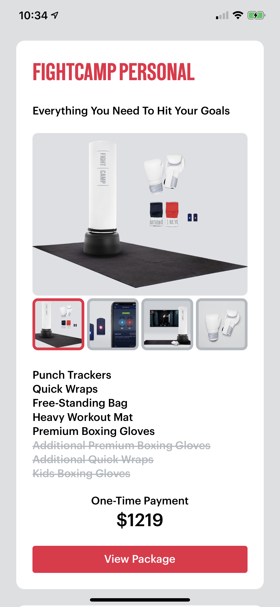
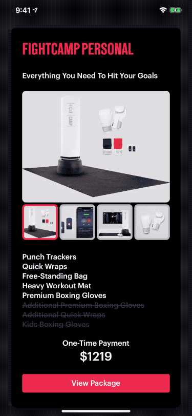

## Summary 🥊

- Swift 
- UIKit
- No storyboard or nibs - everything programmatically
- Light & dark mode compatible
- Demo Combine for processing data
- Delegate pattern
- Dependency Injection (property) for View and ViewModel layer

## Advanced points 🥊

- Display price with currency formatter
- Save selected status in Item View Model

## Screenshots

